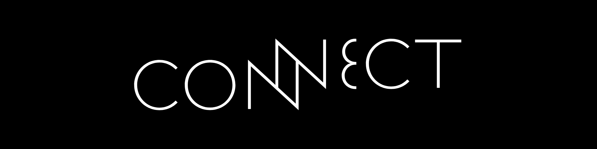

# Connect

> A startup IoT company that provides various innovative products to help solve everyday issues related to home, pets, and health.

## Members

- Muhammad Dony Mulya (2209106047)
- Muhammad Dirga Apriliansyah (2209106050)
- Dio Dharmaesa (2209106053)
- Renaldi Pratama (2209106054)
- Muhammad Hamzah (2209106055)

## Repository Contents

- **Storyboard:** This directory contains the storyboard for our website.
- **Wireframe:** The wireframe directory includes the wireframes for our website. Wireframes are visual guides that represent the skeletal framework of our application, showcasing the layout and functionality.
- **Presentation:** This directory contains the presentation slides for our project.

## Link

- [Figma](<https://www.figma.com/file/3zWD0iq6URDQrqPS7YNDVy/Wireframe-()?type=design&node-id=0%3A1&mode=design&t=rcj5aqAca1Hx6kAN-1>)

## Credits

- [Website Wireframes UI Kit by UI-UX Expert(Aashifa)](https://www.figma.com/community/file/1212997233512196965). Licensed under [CC BY 4.0](https://creativecommons.org/licenses/by/4.0/).
  The wireframes have been modified to suit the specific design requirements of our project.
